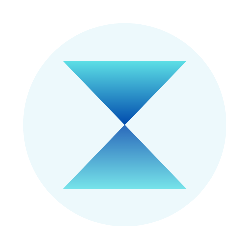

# Amdion Computer

**A calm layer for your attention, on your Mac.** Amdion helps you *see* where your attention goes on your computer and *manage* it — so you're driving, not being driven. Everything stays on your device.

It's not an OS replacement and not a browser you live inside. It's an attention *layer*: a calm front door you summon from the menu bar, plus a companion extension that watches — and, when you ask it to, gently defends — the real Chrome you already use.



## What V1 is

Two halves that connect over a localhost bridge:

```
Desktop app  ──intent / friction──▶  Extension (Defend)
   Sense          localhost WS           Act
 (log / review)  ◀──activity / track──  (Off / Nudge / Block)
```

- **Desktop app — Sense.** Summon it with `⌃⇧A`. Say what you're here to do (your **intent**), and it keeps an honest, private record of how you actually spend your time — which you can review in **Today** and export to CSV/JSON. Lives in the menu bar; no Dock icon, no window to manage.
- **Chrome extension — Defend.** A companion that always *tracks* your browsing, and applies exactly the friction you choose on a set of distraction sites:

  | Mode | What it does |
  |------|--------------|
  | **Off** | Track only — just watches. |
  | **Nudge** | A quiet in-page nudge card on distraction sites. |
  | **Block** | Redirects distraction sites to a calm blocked page. |

  The toggle lives in the **extension's toolbar button**. When the app is connected and you've set an intent, your intent picks the mode for you:

  | Intent | Mode |
  |--------|------|
  | Deep work | Block |
  | Communication | Nudge |
  | Exploration | Off |

  A manual toggle is a session-scoped override; a new session or a new intent re-asserts the intent default. With no app connected, Defend starts gently on (**Nudge**), and your last manual choice sticks.

Your real Chrome profile, logins, and other extensions are untouched.

## Quick start

Amdion runs on **macOS + Chrome**. There's no one-click download yet (a signed build is the demand-phase upgrade — see *Status*), so for now you build it from source. It takes about five minutes, most of which is the first Rust compile. A locally-built app isn't quarantined, so there's no Gatekeeper prompt.

> **Installing with an AI coding agent?** Point it at this repo and tell it: *"Set up and run Amdion on my Mac — install any missing prerequisites, build the Tauri app, then help me load the Chrome extension."* Everything below is what it'll do.

**Prerequisites:** [Rust](https://rustup.rs) · [Node.js](https://nodejs.org) 18+ · Google Chrome · macOS 10.15+

**1. Build & run the app**

```bash
git clone https://github.com/vroy2008/amdion-computer.git
cd amdion-computer
npm install
npm run dev          # builds + launches Amdion (first build takes a few minutes)
```

An hourglass appears in your menu bar, and a short first-run walks you through optional Mac tuning and connecting Chrome. Press **`⌃⇧A`** to summon the panel any time.

For a standalone `.app` to keep around instead of dev mode, run `npm run build` and find it under `src-tauri/target/release/bundle/macos/AMDION.app`.

**2. Connect Chrome** (the companion extension)

1. Open `chrome://extensions`
2. Turn on **Developer mode** (top-right)
3. Click **Load unpacked** and choose this repo's **`extension/`** folder

The extension's toolbar popup shows **Connected** once it links to the app over the localhost bridge — now tracking, the friction modes, and the Today log all reflect your real Chrome.

## Using it

- **Summon / dismiss** — `⌃⇧A`, or click the menu-bar hourglass. `Esc` dismisses.
- **Set your attention** — pick **Deep work · Communication · Exploration**, or name your own. The intent is per-session and is recorded to your honest log; when connected, it also drives the extension's mode.
- **Choose your friction directly** — open the extension's toolbar button and pick **Off · Nudge · Block** for this session. (Setting an intent in the app re-asserts the mapped mode.)
- **Tune your Mac** — a few reversible tweaks for a quieter desktop, offered during first-run and available any time under **Tune your Mac** on the panel.
- **Today** — the bar-chart icon opens your honest daily log: time on computer, per-app and per-site breakdown, and sessions. Export the full event log to **CSV / JSON** from there. It resets each day; everything stays on your device.

## Status

**V1 core is built and verified locally** on macOS: the menu-bar front door + first-run Mac/Chrome tuning, intent capture, the sensing engine + the **Today** Observer (with CSV/JSON export), and the companion extension's **Off / Nudge / Block** modes with intent-driven switching over the localhost bridge.

The remaining V1 gates are a **real-Chrome end-to-end smoke test** of the three modes and intent switching (the dev environment can't run an MV3 service worker), and packaging polish. **Distribution is app-first / build-from-source** for now — the audience is developers and early adopters. The **demand-phase upgrade** is a one-click path: an Apple Developer signed + notarized DMG with an auto-updater, and the extension on the Chrome Web Store.

> Detailed running log: [STATUS.md](STATUS.md) · the V1 scope-of-truth: [docs/V1.md](docs/V1.md) · vision & architecture: [docs/ROADMAP.md](docs/ROADMAP.md) · distribution: [docs/DEPLOYMENT.md](docs/DEPLOYMENT.md) · dev loop: [docs/DEV.md](docs/DEV.md).

### Beyond V1 (also in the repo)

The repo carries a **bonus shelf** — Read Mode (an in-page reader, `⌃⇧R`), Notes/Capture (`⌃⇧C`), Present, and a page-reshaping layer (declutter / feed-fade / drift nudges) — plus a **deferred assistant**. None of these are part of the V1 spine. They live under `extension/features/` behind a feature registry and are **dormant by default**: a fresh install runs only Sense + Off/Nudge/Block. A feature's code — worker hooks *and* content scripts — loads only when it's explicitly unlocked (the extension registers a feature's content scripts via `chrome.scripting` only while its flag is on; see [`extension/core/registry.js`](extension/core/registry.js)). The per-feature unlock onboarding is a planned follow-up.

## Architecture

- **Tauri v2** — Rust backend: native menu-bar window, macOS idle/active/screen sensing, a SQLite event store, and the localhost WebSocket bridge.
- **Chrome extension (MV3)** — `core/` (bridge, activity track, nudge, block) talks to the app over a **localhost WebSocket**. Bonus modules live under `features/` behind a registry enable map that defaults **off**; an enabled feature's content scripts are registered dynamically via `chrome.scripting`, so dormant features run no code (see *Beyond V1*).
- **Vanilla frontend** — HTML/CSS/JS for the front door, intent, and Observer UI, via a small `bridge.js` adapter.

## Project structure

```
src-tauri/   # Tauri v2 Rust backend (app, sensing, db, bridge, commands)
frontend/    # Front door + Observer UI, bridge.js adapter
extension/   # Chrome MV3 extension — core/ (track, nudge, block) + features/ (bonus)
docs/        # V1 scope, ROADMAP, DEPLOYMENT, DEV loop, product concept
```

## License

Amdion is released under the [MIT License](LICENSE) — © 2026 AMDION. Third-party components are listed in [THIRD-PARTY-NOTICES.md](THIRD-PARTY-NOTICES.md); notably, Read Mode bundles Mozilla's [Readability](https://github.com/mozilla/readability) (Apache-2.0), and the app is built on [Tauri](https://tauri.app) (MIT/Apache-2.0).

The **AMDION** name, the amdion.org identity, and the logo are brand assets of the author — the MIT grant covers the code, not the brand. Forks should rebrand.

---

*Built by [AMDION](https://amdion.org) — Time is your most valuable asset. We help you protect it.*
